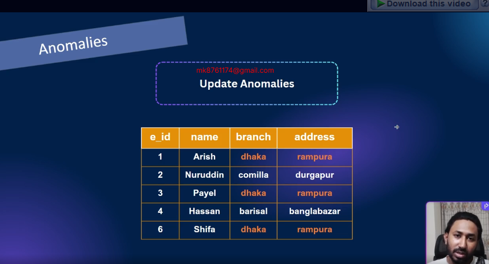
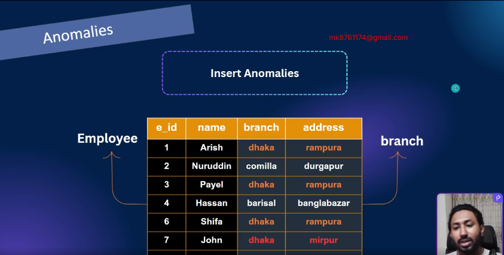

Slide Link: https://drive.google.com/file/d/1Sp_11zUXL8u6lKK7cJ4s4an8cjJ-JNU7/view?usp=sharing

In this module, we will explore data anomalies and the different types of anomalies in DBMS.

You’ll learn normalization step by step – from 1NF to 3NF – with clear examples.

We will also cover resolving many-to-many relationships and updating ER diagrams using junction tables.

## 43-1 Data Anomalies and Types of Anomalies in DBMS
#### Anomalies
- Imbalance in database is called anomalies
- Anomalies in databases refer to inconsistencies or unexpected issues that can occur during data manipulation or retrieval
#### Types Of Anomalies
- Update Anomalies
- Delete Anomalies
- Insert Anomalies

- Here Branch Dhaka and address Rampura came multiple times which is data duplication. suppose the branch name changes to Khilgao we have to update each Dhaka manually
- If there is data duplications in a table we will say there is any of the anomalies

- Hassan works in barisal bagher bazar. If we delete hasan barisal branch information will be gone This is called delete anomalies

- Suppose new person came and we have gave wrong address. Dhaka branch address will be different. we need some validations like it should be Rampura.
- This kind of table separations are called Normalizations