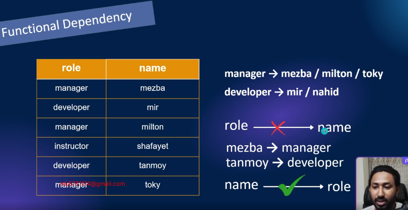
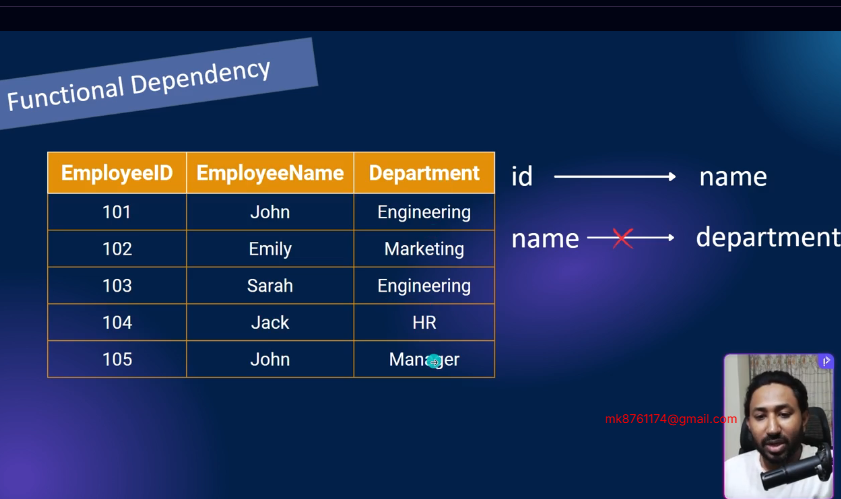
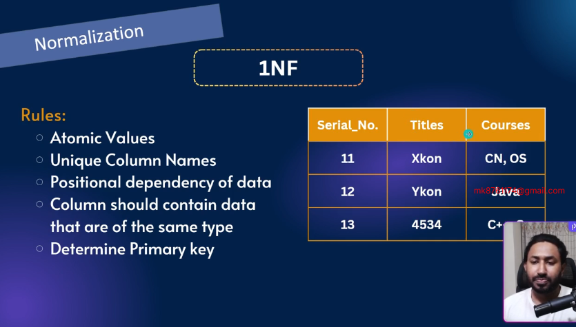
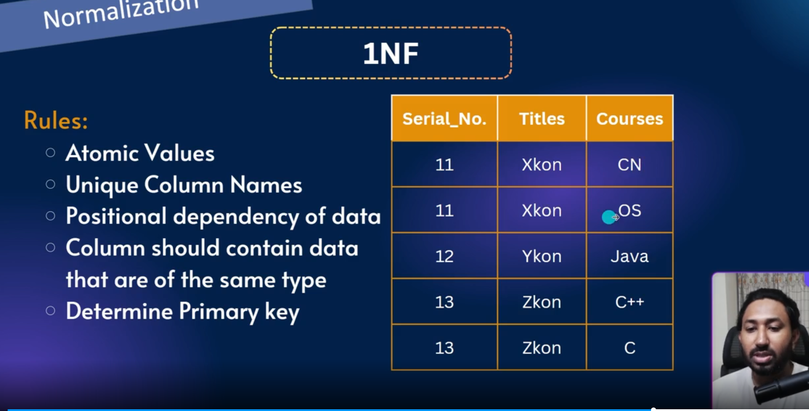

Slide Link: https://drive.google.com/file/d/1Sp_11zUXL8u6lKK7cJ4s4an8cjJ-JNU7/view?usp=sharing

In this module, we will explore data anomalies and the different types of anomalies in DBMS.

You’ll learn normalization step by step – from 1NF to 3NF – with clear examples.

We will also cover resolving many-to-many relationships and updating ER diagrams using junction tables.

## 43-1 Data Anomalies and Types of Anomalies in DBMS
#### Anomalies
- Imbalance in database is called anomalies
- Anomalies in databases refer to inconsistencies or unexpected issues that can occur during data manipulation or retrieval
#### Types Of Anomalies
- Update Anomalies
- Delete Anomalies
- Insert Anomalies

- Here Branch Dhaka and address Rampura came multiple times which is data duplication. suppose the branch name changes to Khilgao we have to update each Dhaka manually
- If there is data duplications in a table we will say there is any of the anomalies

- Hassan works in barisal bagher bazar. If we delete hasan barisal branch information will be gone This is called delete anomalies

- Suppose new person came and we have gave wrong address. Dhaka branch address will be different. we need some validations like it should be Rampura.
- This kind of table separations are called Normalizations

## 43-2 Normalization and Functional Dependency
- Normalization is a step by step process by using which we can remove any anomalies in our database
## Functional Dependency
- Functional dependency in simple terms means that the value of one attribute (or set of attributes) uniquely determines the value of another attribute(s) in a table        

## 43-3 1NF Explained | First Normal Form with Easy Example
#### Normal Forms
- A set of rules applied to a database table to reduce redundancy and avoid anomalies in data by organizing it properly
#### Type of normal forms
- 0NF
- 1NF
- 2NF
- 3NF

 #### 1NF
 Rules :
- Atomic Values (like address Broken in small pieces like house, road, sector)
- Unique Column Names
- Can not have Positional dependency of data
- Column should contain data that are of the same type
- Determine Primary key

- all rules followed

- lets see the table where is the problem and how to convert in 1NF
- So far we have unique column names it ok
- we have no positional dependency of data
- In title we have to keep title not number
- and in course the atomicity is not maintained here is multiple course in one field
- lets fix this

- here comes the 1NF conversion
- Still data duplication came in serial number and title
- here we have to consider composite primary key for determining uniquely
- These will be fixed in 2NF